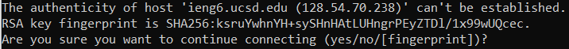
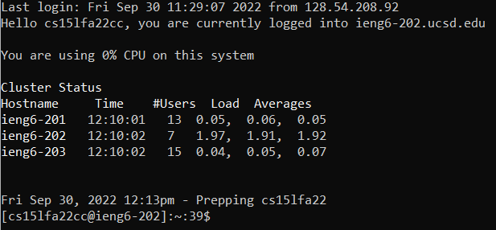
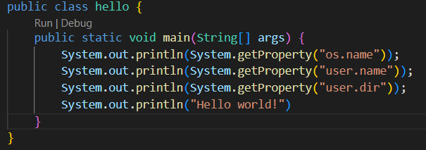
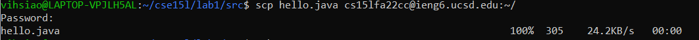
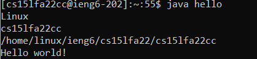
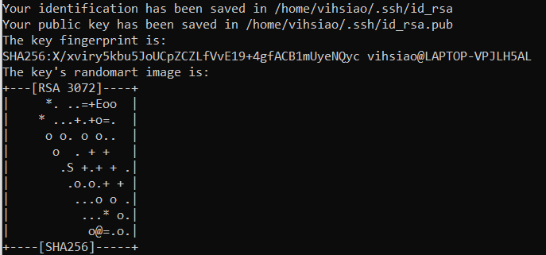
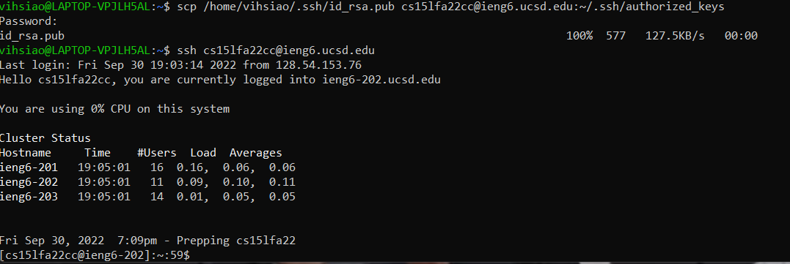

# Lab Report - Week 1

In this tutorial, we will learn to install VScode, connect to a remote 

## Step 1: Install VScode

* Install the latest version of VScode for your computer at this [link](https://code.visualstudio.com/)
* Install based on the OS you are running (Windows, MacOS, Linux)
* If you installed it correctly, you should be able to open a window that looks like this:

## Step 2: Connect to ieng6

* Open up the terminal

* Enter in this command `ssh cs15lfa22__@ieng6.ucsd.edu`, but replace the __ with the letters in your class-specific account

* It should return the prompt below

* Type "yes" and press enter, then enter your password

* This should return the reponse down below

## Step 3: Run Commands

You can run some commands on the remote computer, some include

* `ls -a`
* `cd ~`
* `ls`
* `ls -lat`

## Step 4: Copy files from local to remote computer through SCP

Through the command `scp`, you can copy files from your local to remote computer

* Make sure you are logged onto your local computer (not remote), and create the java file `hello.java`

* Insert the following:

* Compile the program

* Run the command `scp hello.java cs15lfa22__@ieng6.ucsd.edu:~/` in the terminal in the directory where you made the file, it will ask you for your password

* Log in with ssh again, run an `ls` command to see if the file is in the remote computer

* The program should compile and run in ssh

## Step 5: SSH Keys

This is to avoid having to type in your password every time you log into ssh or run a command that involves your class-specific username and ssh

* On your local computer (client), run the command `ssh-keygen`

* Press enter for the file and passphrase prompts, you should get something like what is down below

* Log into ssh, then make the directory .ssh through the command `mkdir .ssh`

* Log out and run this scp command `scp /home/_______/.ssh/id_rsa.pub cs15lfa22__@ieng6.ucsd.edu:~/.ssh/authorized_keys`

* You should be able to log into ssh without entering in your password

## Step 6: Optimize Remote Running

Some ways to make running Java programs easier

* After logging into ssh, run `javac` and `java` commands straight after by putting them in quotes

`ssh cs15lfa22@ieng6.ucsd.edu "javac hello.java" "java hello.java"`

* Use semicolons to run multiple commands in one line

`cp hello.java; javac hello.java; java hello.java`