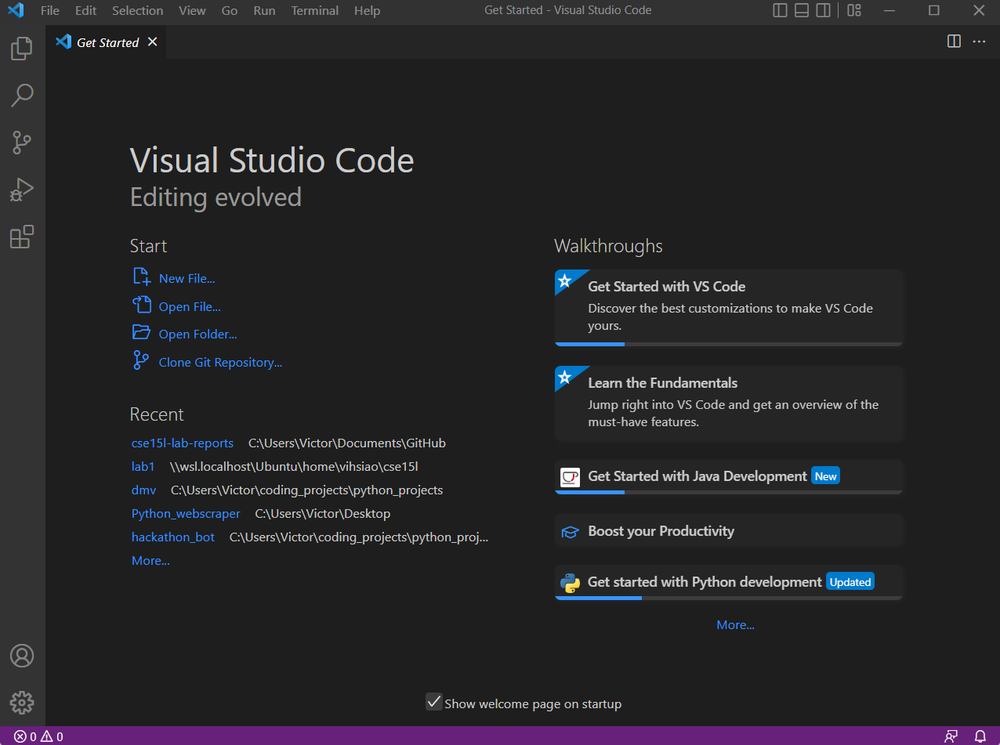

# Lab Report - Week 1

In this tutorial, we will learn to install VScode, 

## Step 1: Install VScode

* Install the latest version of VScode for your computer at this [link](https://code.visualstudio.com/)
* Install based on the OS you are running (Windows, MacOS, Linux)
* If you have installed it correctly, you should be able to open a window that looks like this:

