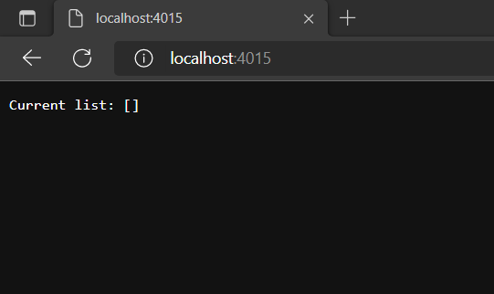
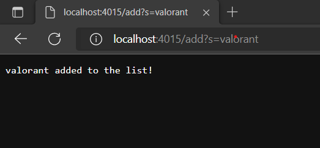
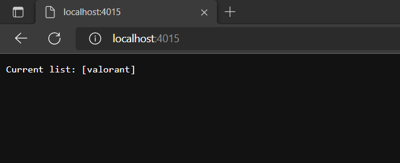
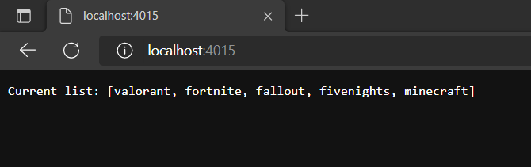
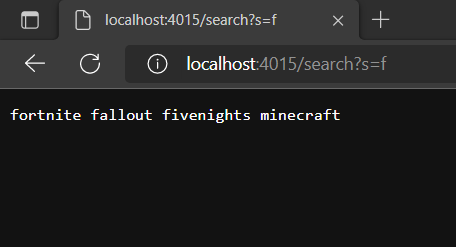
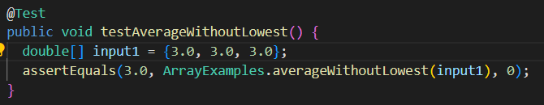
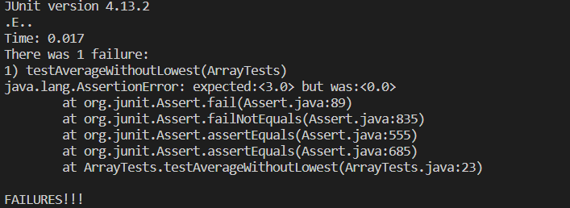
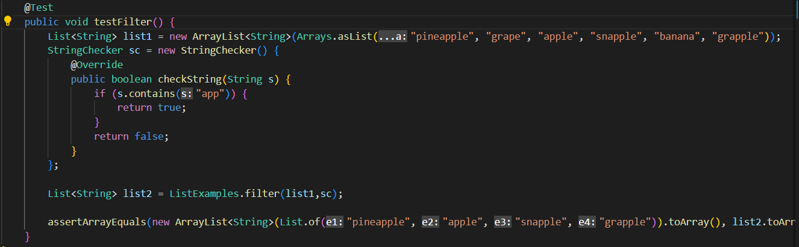
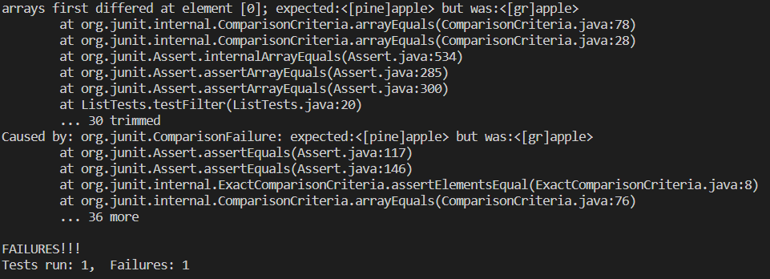
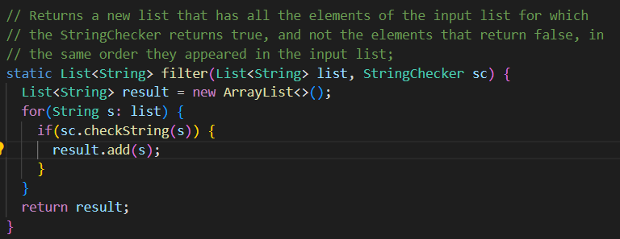

# Lab Report - Week 3

## **Part 1: Search Engine**

The Java code for my Search Engine is down below 

```
import java.io.IOException;
import java.net.URI;
import java.util.ArrayList;

class Handler implements URLHandler {
    String s = "";

    ArrayList<String> queries = new ArrayList<String>();

    public String handleRequest(URI url) {
        if (url.getPath().equals("/")) {
            return String.format("Current list: %s", queries.toString());
        }

        else if (url.getPath().contains("/add")) {
            String[] parameters = url.getQuery().split("=");
            queries.add(parameters[1]);
            return String.format("%s added to the list!", parameters[1]);
        }

        else {
            if (url.getPath().contains("/search")) {
                String[] parameters = url.getQuery().split("=");
                String return_str = "";

                for (int i = 0; i < queries.size(); i++) {
                    if (queries.get(i).contains(parameters[1])) {
                        return_str += (queries.get(i) + " ");
                    }
                }

                return return_str;
            }

            if (url.getPath().contains("/delete")) {
                
            }
        }

        return "404 Not Found!";
    }
}

public class SearchEngine {
    public static void main(String[] args) throws IOException {
        if(args.length == 0){
            System.out.println("Missing port number! Try any number between 1024 to 49151");
            return;
        }

        int port = Integer.parseInt(args[0]);

        Server.start(port, new Handler());
    }
}
```

After compiling the code (commands: `javac Server.java SearchEngine.java` and `java SearchEngine (port number)`), the domain will open at `http://localhost:(port number)/`



The program Server.java allows the localhost to run

The method `handleRequest` is running while the localhost is active

It sees that there is no path, so it prints the line:  `Current list: []`

------

To add an item to the list, you enter the localhost link into the search bar, plus the path `add?s=valorant` (in this case, I added the item `valorant`)



Return to the main page, and the list will contain the item
you just inputted



When you add the path `add?s=` to the localhost, it calls the if statement looking for the keyword `add`, so it will get the part after the `=` and add it to the list

```
else if (url.getPath().contains("/add")) {
    String[] parameters = url.getQuery().split("=");
    queries.add(parameters[1]);
    return String.format("%s added to the list!", parameters[1]);
}
```

**Updated list:**



After adding some items, when searching for an item, you change the path to `search?s=` and after the equals sign you add the keyword (in this case `"f"`)



This command returns all keywords with the character "f" in it

When using the search keyword it activates this if statement, and gets the keyword by pulling the url and getting the path after the `"="`

```
if (url.getPath().contains("/search")) {
    String[] parameters = url.getQuery().split("=");
    String return_str = "";

    for (int i = 0; i < queries.size(); i++) {
        if (queries.get(i).contains(parameters[1])) {
            return_str += (queries.get(i) + " ");
        }
    }

    return return_str;
}
```
---

## **Part 2: Catching Bugs**

In this part, we will test for bugs in the two methods down below

The first method we will look at is `averageWithoutLowest` from the class ArrayExamples

The goal of the method is to get the average of the list of numbers without its lowest number

```
static double averageWithoutLowest(double[] arr) {
    if(arr.length < 2) { return 0.0; }
    double lowest = arr[0];
    for(double num: arr) {
      if(num < lowest) { lowest = num; }
    }
    double sum = 0;
    for(double num: arr) {
      if(num != lowest) { sum += num; }
    }
    return sum / (arr.length - 1);
  }
```

One of the failure-inducing inputs for this method is when the array contains the same element (ex: `[3,3,3,3]`)



It produces the symptom below, where the expected output is 3, but the actual output is 0



The bug in the code is that when trying to exclude the lowest number from the sum, it would remove every instance of it, instead of removing it once

To fix this, remove the lowest number at the end

**Updated Code**

```
static double averageWithoutLowest(double[] arr) {
    if(arr.length < 2) { return 0.0; }
    double lowest = arr[0];
    for(double num: arr) {
      if(num <= lowest) { lowest = num; }
    }
    double sum = 0;
    for(double num: arr) {
      sum += num;
    }
    return (sum - lowest) / (arr.length - 1);
}
```

---

The second method we will look at is `filter` from the class ListExamples

The goal of the method is to filter out all of the strings that contain a certain keyword

```
static List<String> filter(List<String> list, StringChecker sc) {
    List<String> result = new ArrayList<>();
    for(String s: list) {
      if(sc.checkString(s)) {
        result.add(0, s);
      }
    }
    return result;
  }
```

One of the failure-inducing inputs for this method is the array `["pineapple", "grape", "apple", "snapple", "banana", "grapple"]`, where the keyword to check for in each of the strings is `"app"`



The input returns the symptom below



The bug in the code is that when adding the item containing the keyword `"app"` to the `result` list, it adds it to the beginning of the array, causing it to return a list where the words are in reverse order

To fix this, remove the `0` in the add statement, resulting in the code below

