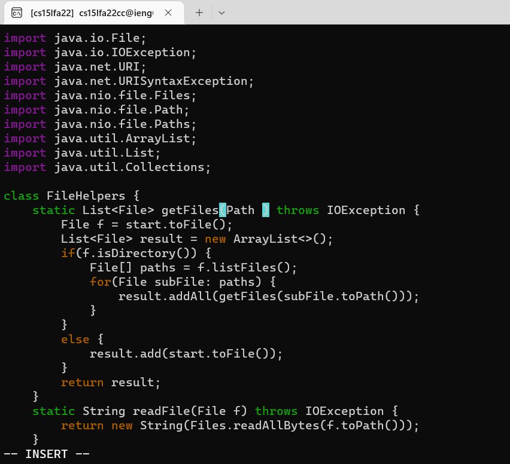

# Lab Report - Week 7

## **Part 1: Week 6 Lab Task**

The task that I will do for this part is:

In `DocSearchServer.java`, add a new line right before `File[] paths = f.listFiles();` that prints out the `toString` of `f` and a message saying it’s a directory.`

First, open `DocSearchServer.java` in Vim

Search for the keyword `start` using the `/` command

To remove the keyword `start`, press `c` and then press `w`

This will place the cursor at the end of the keyword `start`, and `w` will delete it and turn on insert mode

Enter `base`

Leave cursor at line you changed, press `<Esc>` to return to normal mode

To replace all occurrences of `start`, press **`n`** to find the next occurrence of `start`, then press **`.`** to replace it with previous keyword (`base`)

You should replace `file f = start.toFile()` and at the line `result.add(start.toFile())`

**First replacement of `start` to `base`**

**Second replacement of `start` to `base`**

Press `:w` to save the program

The complete sequence should be:

> `/` + `s` + `t` + `a` + `r` + `t` + `Enter` + `c` + `w` + `b` + `a` + `s` + `e` + `<Esc>` + `n` + `.` + `n` + `.` + `:` + `w`

## **Part 2: Local -> Remote vs Just Remote**

The task above can be done in two ways:

You edit `DocSearchServer.java` in VS Code on the local machine and `scp` the folder into `ieng6` and run it there

OR

You load the folder onto the remote server, edit `DocSearchServer` on ssh, and run it there

**First Option**

The task is to edit `DocSearchServer.java` in VS Code on the local machine and `scp` the folder into `ieng6` and run it there

Doing it this way took around 5 minutes, the `scp` took the longest amount of time to do out of all the steps for this task

To scp the entire `skill-demo1` folder and all of its files to ieng6, you have to use the `-r` flag

**Second Option**

For this option, you load the folder onto the remote server, edit `DocSearchServer` on ssh, and run it there

Note: It is assumed that you already loaded the folder onto ieng6

This approach took me around **45** seconds

I used the sequence that was mentioned in part 1 of this report

> `/` + `s` + `t` + `a` + `r` + `t` + `Enter` + `c` + `w` + `b` + `a` + `s` + `e` + `<Esc>` + `n` + `.` + `n` + `.` + `:` + `w` + `q`

**Conclusion**

Between the two approaches mentioned above, I would prefer to use the second approach because it is faster than the first one

It also has to do with the fact that I know enough Vim to be able to use the sequence from part 1 to make doing the task more efficiently

If I didn't know any of the commands, I would have preferred the first option