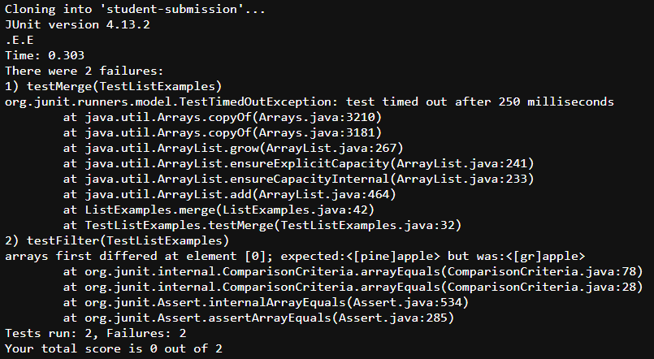
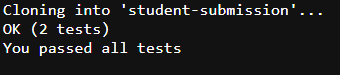
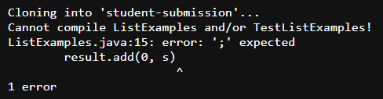
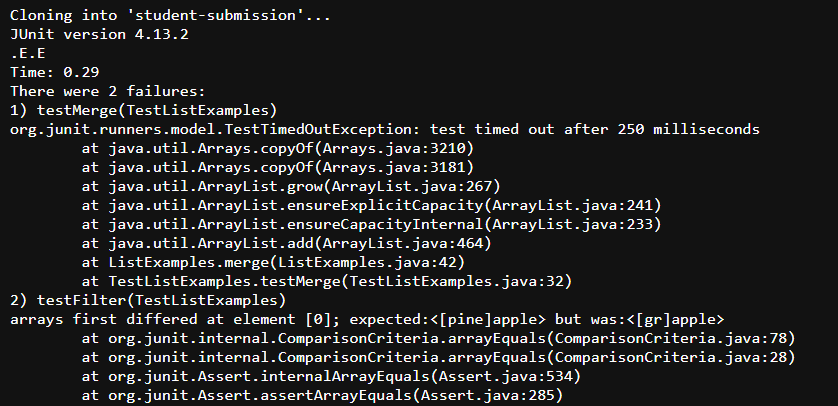
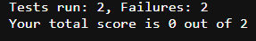

# Lab Report - Week 9

For this lab report, I created an autograder, which is a bash script that would grade the code in a GitHub repo

**Autograder -> `grade.sh`**

```
rm -rf student-submission
git clone $1 student-submission

CP=.:../lib/hamcrest-core-1.3.jar:../lib/junit-4.13.2.jar
CP2=.:../lib/hamcrest-core-1.3.jar:../lib/junit-4.13.2.jar

cp TestListExamples.java student-submission

cd student-submission

if [[ ! -e ListExamples.java ]]
then
    echo "ListExamples.java does not exist in the directory"
    exit 1
fi

javac -cp $CP *.java 2> err.txt

if [[ ! $? -eq 0 ]]
then
    echo "Cannot compile ListExamples and/or TestListExamples!"
    cat err.txt
    exit 1
fi

javac -cp $CP *.java
java -cp $CP2 org.junit.runner.JUnitCore TestListExamples > output.txt

if [[ $? -eq 0 ]]
then
echo "$(grep -w OK output.txt)"
echo "You passed all tests" 
else
failed="$(grep -w Failures output.txt)"
head -20 output.txt
echo $failed
echo "Your total score is" "$((${failed:25:1}-${failed:11:1}))" "out of ${failed:11:1}"
fi

exit 0
```

## **How grade.sh works**

1. Clones GitHub repo and stores ListExamples.java code in student-submission folder

2. Pulls ListExamples from folder student-submission (if statement to check if it existed in github repo that was pulled)

3. Compiles ListExamples and TestListExamples (java file with test cases for ListExamples)

4. Returns error output if at least one of the tests fails, will return tests ran and how many failed, and the total score

## **Three different repos for autograder**


**Repo 1: https://github.com/ucsd-cse15l-f22/list-methods-lab3**




**Repo 2: https://github.com/ucsd-cse15l-f22/list-methods-corrected**



**Repo 3: https://github.com/ucsd-cse15l-f22/list-methods-compile-error**



## **Tracing the Autograder**

In this part, we will walk through every part of our autograder

-------------------

After we clone ListExamples from the GitHub repo, we `cp` the tests (TestListExamples) over to student-submission

``` 
cp TestListExamples.java student-submission 
```

Since TestListExamples already exists, the return code would be 0, unless if it does not exist otherwise return code would be 1

-------------------

We check if ListExamples existed in the GitHub repo we cloned

```
if [[ ! -e ListExamples.java ]]
then
    echo "ListExamples.java does not exist in the directory"
    exit 1
fi
```

If it doesn't exist, return exit code 1, otherwise return code is 0 and autograder continues

-------------------

Next, ListExamples and TestListExamples are compiled, in which the error output would be redirected into the file `err.txt`

If they compile successfully, return code would be 0, `err.txt` would be blank, and autograder will continue

If they do not compile successfully, program returns exit code 1 and the command `cat err.txt` will print out the compile errors that occurred in ListExamples and/or TestListExamples

**Ex: https://github.com/ucsd-cse15l-f22/list-methods-compile-error**

The image below is what is in `err.txt` if ListExamples and/or TestListExamples does not compile successfully


-----------------------

```
java -cp $CP2 org.junit.runner.JUnitCore TestListExamples > output.txt

if [[ $? -eq 0 ]]
then
echo "$(grep -w OK output.txt)"
echo "You passed all tests" 
else
failed="$(grep -w Failures output.txt)"
head -20 output.txt
echo $failed
echo "Your total score is" "$((${failed:25:1}-${failed:11:1}))" "out of ${failed:11:1}"
fi

exit 0
```

After TestListExamples and ListExamples compile successfully, the autograder will run the tests provided in TestListExamples and redirects the output in `output.txt`

If at least one test does not pass, `output.txt` will contain the total output that was printed, exit return code will be 1, and the first 20 lines will be printed to show only the symptoms of the test(s)



The number of tests ran and tests failed will be returned also



If all tests passed, exit return code is 0 and autograder will return a message that shows that you passed all tests

-------------------------